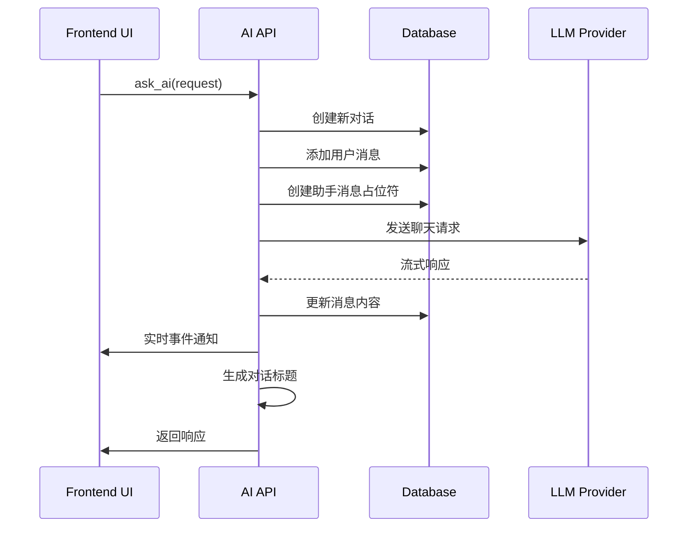
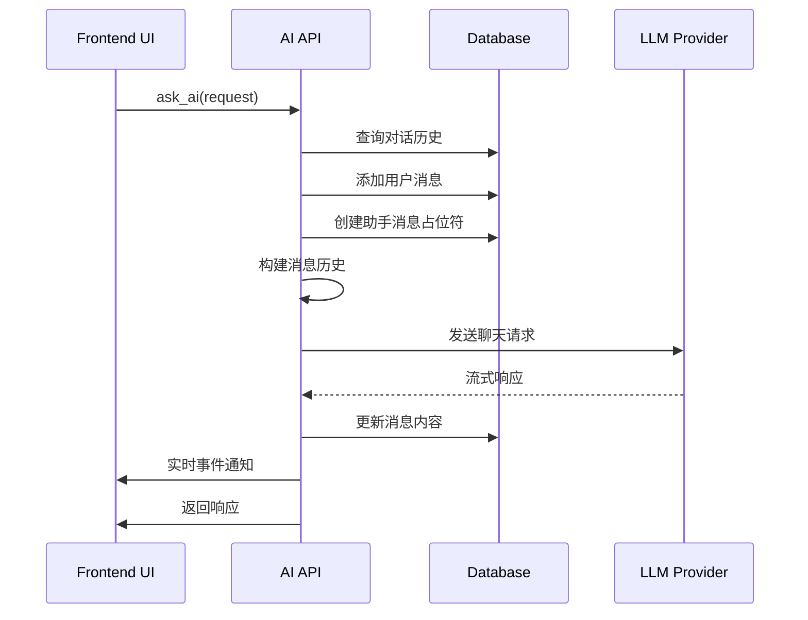
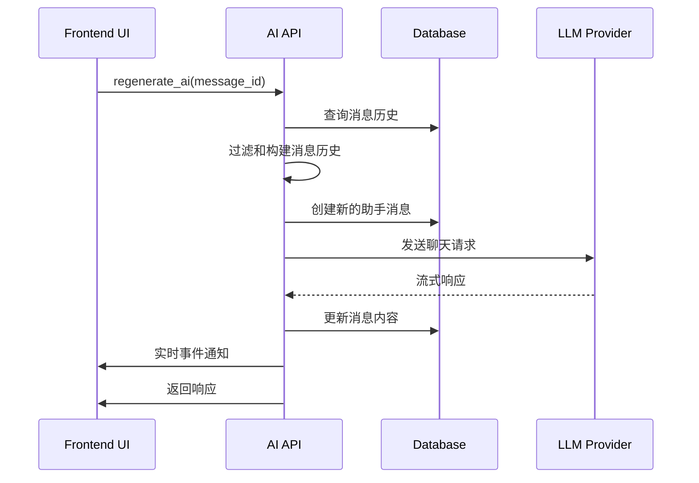

# AI API 技术说明文档

## 概述

AI API 模块是 Tea 应用的核心组件，负责处理与大语言模型的交互，包括对话生成、消息管理、配置处理等功能。本文档详细说明了 AI API 的架构设计、接口规范、配置管理和最佳实践。

## 目录

- [架构设计](#架构设计)
- [核心组件](#核心组件)
- [API 接口](#api-接口)
- [配置管理](#配置管理)
- [数据流程](#数据流程)
- [错误处理](#错误处理)
- [性能优化](#性能优化)
- [扩展指南](#扩展指南)
- [最佳实践](#最佳实践)

## 架构设计

### 整体架构

```
┌─────────────────┐    ┌─────────────────┐    ┌─────────────────┐
│   Frontend UI   │    │   Tauri Core    │    │   AI Providers  │
│                 │◄──►│                 │◄──►│                 │
│ - Chat UI       │    │ - AI API        │    │ - OpenAI        │
│ - Config UI     │    │ - Config Mgmt   │    │ - Anthropic     │
│ - File Upload   │    │ - DB Manager    │    │ - Gemini        │
└─────────────────┘    └─────────────────┘    └─────────────────┘
```

### 模块分层

```
┌──────────────────────────────────────────────────────────┐
│                    API Layer                             │
│  ask_ai() | regenerate_ai() | cancel_ai() | generate_title() │
├──────────────────────────────────────────────────────────┤
│                  Service Layer                           │
│  ConfigBuilder | ChatProcessor | MessageHandler         │
├──────────────────────────────────────────────────────────┤
│                 Repository Layer                         │
│  ConversationDB | LLMProviderDB | AssistantDB           │
├──────────────────────────────────────────────────────────┤
│                 Infrastructure Layer                     │
│  GenAI Client | Database | File System | Template Engine │
└──────────────────────────────────────────────────────────┘
```

## 核心组件

### 1. ConfigBuilder

配置构建器，负责统一管理所有配置相关的逻辑。

```rust
struct ConfigBuilder;

impl ConfigBuilder {
    // 构建聊天配置
    async fn build_chat_config(
        db_manager: &DatabaseManager,
        assistant_detail: &AssistantDetail,
        override_model_config: Option<HashMap<String, serde_json::Value>>,
    ) -> Result<ChatConfig, AppError>;
    
    // 创建客户端配置
    fn create_client_with_config(
        configs: &[LLMProviderConfig], 
        model_name: &str,
        api_type: &str
    ) -> Result<Client, AppError>;
    
    // 合并模型配置
    fn merge_model_configs(
        base_configs: Vec<AssistantModelConfig>,
        model_detail: &ModelDetail,
        override_configs: Option<HashMap<String, serde_json::Value>>,
    ) -> Vec<AssistantModelConfig>;
}
```

**职责**:
- 统一配置构建逻辑
- 处理配置覆盖和合并
- 创建和配置 GenAI 客户端
- 推断适配器类型和端点

### 2. 流式处理器

#### handle_stream_chat()
处理流式聊天响应，支持实时数据流传输。

```rust
async fn handle_stream_chat(
    client: &Client,
    model_name: &str,
    chat_request: ChatRequest,
    chat_options: &ChatOptions,
    message_id: i64,
    tx: &mpsc::Sender<(i64, String, bool)>,
    cancel_token: &CancellationToken,
    conversation_db: &ConversationDatabase,
    tokens: &Arc<tokio::sync::Mutex<HashMap<i64, CancellationToken>>>,
) -> Result<(), anyhow::Error>;
```

**特性**:
- 支持实时流式响应
- 处理多种事件类型（Start, Chunk, ReasoningChunk, ToolCallChunk, End）
- 支持取消操作
- 自动更新数据库时间戳

#### handle_non_stream_chat()
处理非流式聊天响应，适用于一次性获取完整响应。

### 3. 消息处理器

#### handle_chat_response()
统一处理聊天响应消息的接收、数据库更新、事件发送等逻辑。

```rust
async fn handle_chat_response(
    app_handle: tauri::AppHandle,
    window: tauri::Window,
    message_id: i64,
    conversation_id: i64,
    request_prompt_result: String,
    need_generate_title: bool,
    config_feature_map: HashMap<String, HashMap<String, FeatureConfig>>,
    tokens: Arc<tokio::sync::Mutex<HashMap<i64, CancellationToken>>>,
    mut rx: mpsc::Receiver<(i64, String, bool)>,
);
```

**功能**:
- 接收和处理消息更新
- 更新数据库记录
- 发送前端事件通知
- 处理超时和错误情况
- 自动生成对话标题

## API 接口

### 1. ask_ai

主要的 AI 对话接口，支持新建对话和继续对话。

```rust
#[tauri::command]
pub async fn ask_ai(
    app_handle: tauri::AppHandle,
    state: State<'_, AppState>,
    feature_config_state: State<'_, FeatureConfigState>,
    message_token_manager: State<'_, MessageTokenManager>,
    window: tauri::Window,
    request: AiRequest,
    override_model_config: Option<HashMap<String, serde_json::Value>>,
    override_prompt: Option<String>,
) -> Result<AiResponse, AppError>;
```

**请求参数**:
```rust
pub struct AiRequest {
    conversation_id: String,        // 对话ID，空字符串表示新对话
    assistant_id: i64,             // 助手ID
    prompt: String,                // 用户输入
    model: Option<String>,         // 模型名称（可选）
    temperature: Option<f32>,      // 温度参数（可选）
    top_p: Option<f32>,           // Top-p 参数（可选）
    max_tokens: Option<u32>,      // 最大令牌数（可选）
    stream: Option<bool>,         // 是否流式响应（可选）
    attachment_list: Option<Vec<i64>>, // 附件列表（可选）
}
```

**响应结果**:
```rust
pub struct AiResponse {
    conversation_id: i64,                    // 对话ID
    add_message_id: i64,                    // 新增消息ID
    request_prompt_result_with_context: String, // 处理后的请求内容
}
```

**处理流程**:
1. 解析模板变量（如 selected_text）
2. 初始化或继续对话
3. 构建聊天配置
4. 异步处理 AI 请求
5. 返回响应信息

### 2. regenerate_ai

重新生成 AI 响应的接口。

```rust
#[tauri::command]
pub async fn regenerate_ai(
    app_handle: tauri::AppHandle,
    message_token_manager: State<'_, MessageTokenManager>,
    window: tauri::Window,
    message_id: i64,
) -> Result<AiResponse, AppError>;
```

**功能特点**:
- 基于历史消息重新生成响应
- 自动过滤和构建消息历史
- 支持父子消息关系处理

### 3. cancel_ai

取消正在进行的 AI 请求。

```rust
#[tauri::command]
pub async fn cancel_ai(
    message_token_manager: State<'_, MessageTokenManager>,
    message_id: i64,
) -> Result<(), String>;
```

### 4. generate_title

自动生成对话标题。

```rust
async fn generate_title(
    app_handle: &tauri::AppHandle,
    conversation_id: i64,
    user_prompt: String,
    content: String,
    config_feature_map: HashMap<String, HashMap<String, FeatureConfig>>,
    window: tauri::Window,
) -> Result<(), AppError>;
```

## 配置管理

### 1. 模型配置

支持多种大语言模型提供商：

```rust
// 支持的适配器类型
enum AdapterKind {
    OpenAI,      // OpenAI GPT 系列
    Anthropic,   // Claude 系列
    Cohere,      // Command 系列
    Gemini,      // Google Gemini
    Groq,        // Groq 模型
    Xai,         // X.AI Grok
    DeepSeek,    // DeepSeek 模型
    Ollama,      // 本地 Ollama
}
```

**默认端点配置**:
```rust
const DEFAULT_ENDPOINTS: &[(AdapterKind, &str)] = &[
    (AdapterKind::OpenAI, "https://api.openai.com/v1"),
    (AdapterKind::Anthropic, "https://api.anthropic.com"),
    (AdapterKind::Cohere, "https://api.cohere.ai/v1"),
    (AdapterKind::Gemini, "https://generativelanguage.googleapis.com/v1beta"),
    (AdapterKind::Groq, "https://api.groq.com/openai/v1"),
    (AdapterKind::Xai, "https://api.x.ai/v1"),
    (AdapterKind::DeepSeek, "https://api.deepseek.com/"),
    (AdapterKind::Ollama, "http://localhost:11434"),
];
```

### 2. 聊天选项

支持的聊天参数：

```rust
struct ChatOptions {
    temperature: Option<f64>,    // 创造性控制 (0.0-2.0)
    max_tokens: Option<u32>,     // 最大生成令牌数
    top_p: Option<f64>,         // 核采样参数 (0.0-1.0)
    stream: Option<bool>,       // 是否启用流式响应
}
```

### 3. 配置覆盖

支持运行时配置覆盖：

```rust
// 覆盖配置示例
let override_config = HashMap::from([
    ("temperature".to_string(), serde_json::Value::Number(0.7.into())),
    ("max_tokens".to_string(), serde_json::Value::Number(2000.into())),
    ("stream".to_string(), serde_json::Value::Bool(true)),
]);
```

## 数据流程

### 1. 新对话流程



### 2. 继续对话流程



### 3. 重新生成流程



## 错误处理

### 1. 错误类型

```rust
pub enum AppError {
    DatabaseError(String),           // 数据库错误
    NoModelFound,                   // 未找到模型
    NoConfigError(String),          // 配置缺失错误
    ProviderError(String),          // 提供商错误
    ValidationError(String),        // 验证错误
    NetworkError(String),           // 网络错误
    TimeoutError(String),           // 超时错误
}
```

### 2. 错误处理策略

- **网络错误**: 自动重试机制，最多重试 3 次
- **超时错误**: 10 分钟超时，支持取消操作
- **配置错误**: 返回详细错误信息，指导用户修复
- **数据库错误**: 记录错误日志，返回用户友好提示

### 3. 错误恢复

```rust
// 示例：带重试的请求处理
async fn handle_request_with_retry(
    request: ChatRequest,
    max_retries: u32,
) -> Result<ChatResponse, AppError> {
    let mut retries = 0;
    loop {
        match execute_request(&request).await {
            Ok(response) => return Ok(response),
            Err(e) if retries < max_retries => {
                retries += 1;
                tokio::time::sleep(Duration::from_secs(2_u64.pow(retries))).await;
                continue;
            }
            Err(e) => return Err(e),
        }
    }
}
```

## 性能优化

### 1. 异步处理

- 所有 AI 请求都在独立的 tokio 任务中处理
- 支持并发处理多个请求
- 使用 mpsc 通道进行异步通信

### 2. 内存管理

- 使用 Arc 和 Mutex 进行线程安全的状态管理
- 及时清理取消的请求令牌
- 避免不必要的数据克隆

### 3. 数据库优化

- 使用连接池管理数据库连接
- 批量更新消息状态
- 索引优化查询性能

### 4. 缓存策略

```rust
// 配置缓存示例
struct ConfigCache {
    model_configs: Arc<RwLock<HashMap<i64, ModelConfig>>>,
    assistant_configs: Arc<RwLock<HashMap<i64, AssistantConfig>>>,
}

impl ConfigCache {
    async fn get_or_load_model_config(&self, model_id: i64) -> Result<ModelConfig, AppError> {
        // 先查缓存，未命中则从数据库加载
    }
}
```

## 扩展指南

### 1. 添加新的 LLM 提供商

1. 在 `AdapterKind` 枚举中添加新的变体
2. 在 `DEFAULT_ENDPOINTS` 中添加默认端点
3. 更新 `infer_adapter_kind` 函数的推断逻辑
4. 测试新提供商的集成

```rust
// 示例：添加新提供商
enum AdapterKind {
    // ... 现有提供商
    NewProvider,  // 新提供商
}

const DEFAULT_ENDPOINTS: &[(AdapterKind, &str)] = &[
    // ... 现有端点
    (AdapterKind::NewProvider, "https://api.newprovider.com/v1"),
];
```

### 2. 扩展配置选项

1. 在 `ChatOptions` 中添加新字段
2. 更新 `build_chat_options` 函数
3. 在前端添加相应的配置界面

```rust
// 示例：添加新配置选项
struct ChatOptions {
    // ... 现有选项
    presence_penalty: Option<f64>,  // 新选项
    frequency_penalty: Option<f64>, // 新选项
}
```

### 3. 添加新的 API 接口

1. 定义请求和响应结构体
2. 实现 Tauri 命令函数
3. 添加相应的错误处理
4. 更新前端调用代码

```rust
// 示例：新 API 接口
#[tauri::command]
pub async fn new_ai_function(
    app_handle: tauri::AppHandle,
    request: NewRequest,
) -> Result<NewResponse, AppError> {
    // 实现逻辑
}
```

## 最佳实践

### 1. 代码组织

- **单一职责**: 每个函数只负责一个明确的功能
- **依赖注入**: 通过参数传递依赖，避免全局状态
- **错误处理**: 使用 Result 类型进行错误传播
- **异步编程**: 合理使用 async/await 和 tokio

### 2. 配置管理

- **环境隔离**: 开发、测试、生产环境使用不同配置
- **安全存储**: API 密钥等敏感信息加密存储
- **配置验证**: 启动时验证配置的完整性和有效性
- **热更新**: 支持运行时配置更新

### 3. 性能监控

```rust
// 示例：性能监控
use std::time::Instant;

async fn monitored_ai_request(request: ChatRequest) -> Result<ChatResponse, AppError> {
    let start = Instant::now();
    let result = execute_request(request).await;
    let duration = start.elapsed();
    
    // 记录性能指标
    log::info!("AI request completed in {:?}", duration);
    
    result
}
```

### 4. 测试策略

```rust
#[cfg(test)]
mod tests {
    use super::*;
    
    #[tokio::test]
    async fn test_config_builder() {
        // 测试配置构建逻辑
    }
    
    #[tokio::test]
    async fn test_message_handling() {
        // 测试消息处理逻辑
    }
    
    #[tokio::test]
    async fn test_error_handling() {
        // 测试错误处理逻辑
    }
}
```

### 5. 日志记录

```rust
// 示例：结构化日志
use tracing::{info, warn, error, instrument};

#[instrument(skip(request))]
async fn process_ai_request(request: AiRequest) -> Result<AiResponse, AppError> {
    info!("Processing AI request for assistant {}", request.assistant_id);
    
    match execute_request(request).await {
        Ok(response) => {
            info!("AI request completed successfully");
            Ok(response)
        }
        Err(e) => {
            error!("AI request failed: {}", e);
            Err(e)
        }
    }
}
```

## 故障排查

### 1. 常见问题

**问题**: API 请求超时
**原因**: 网络连接问题或模型响应慢
**解决**: 检查网络连接，调整超时时间，考虑使用更快的模型

**问题**: 配置错误
**原因**: API 密钥无效或端点配置错误
**解决**: 验证 API 密钥，检查端点配置，查看错误日志

**问题**: 内存泄漏
**原因**: 取消的请求没有正确清理
**解决**: 确保 cleanup_token 函数被正确调用

### 2. 调试技巧

```rust
// 启用详细日志
RUST_LOG=debug cargo run

// 检查数据库状态
SELECT * FROM conversations WHERE id = ?;
SELECT * FROM messages WHERE conversation_id = ?;

// 监控内存使用
use std::alloc::{GlobalAlloc, Layout, System};

struct TracingAllocator;

unsafe impl GlobalAlloc for TracingAllocator {
    unsafe fn alloc(&self, layout: Layout) -> *mut u8 {
        let ptr = System.alloc(layout);
        println!("Allocated {} bytes at {:p}", layout.size(), ptr);
        ptr
    }
    
    unsafe fn dealloc(&self, ptr: *mut u8, layout: Layout) {
        println!("Deallocated {} bytes at {:p}", layout.size(), ptr);
        System.dealloc(ptr, layout);
    }
}
```

---

## 总结

AI API 模块经过三轮重构优化，已经形成了清晰的架构和良好的代码组织。主要特点包括：

1. **模块化设计**: 职责清晰，易于维护和扩展
2. **异步处理**: 高性能的并发处理能力
3. **配置灵活**: 支持多种模型和运行时配置
4. **错误健壮**: 完善的错误处理和恢复机制
5. **性能优化**: 内存管理和数据库优化

该文档为后续开发和维护提供了全面的技术指导，建议开发者在修改代码前仔细阅读相关章节。

---

*文档版本: v1.0*  
*最后更新: 2024年*  
*维护者: Tea 开发团队* 